# Supply Chain Visibility & Disruption Response Agent

An end-to-end AI agent demo on Databricks that transforms supply chain management from reactive to proactive. A logistics lead can **"Chat with the Shipment"** to get real-time disruption assessments and AI-generated recovery plans.

## Architecture



The system follows a four-step pipeline:

### Step 1 — Simulate (Mock Data Generation)

A Python script generates **7 interconnected datasets** with referential integrity: suppliers (30), parts catalog (50 SKUs), supplier inventory (100), production lines (5), purchase orders (100), storm alerts (3), and sea freight tracking (200 position records). Data is uploaded to a **Unity Catalog Volume** and registered as Delta tables.

### Step 2 — Evaluate (Lakeflow SDP Pipeline)

A **Spark Declarative Pipeline** (deployed via Databricks Asset Bundles) produces three materialized views:

| Layer | View | Logic |
|-------|------|-------|
| Silver | `silver_shipment_health` | Joins freight tracking + purchase orders + storm alerts using **Haversine distance** to compute storm proximity; classifies each shipment as `CRITICAL`, `WARNING`, or `NORMAL` |
| Silver | `silver_supplier_risk` | Joins suppliers + inventory + parts catalog; flags `CRITICAL`/`LOW`/`BELOW_REORDER` inventory risk and **Tier-2 cascade risk** |
| Gold | `gold_disruption_impact` | Aggregates per production line: impacted shipments, at-risk SKUs, active storms, and **estimated financial exposure** (shutdown cost x delay days) |

### Step 3 — Triage (Lakebase Operational Store)

Silver/Gold Delta tables are synced to **Lakebase** (managed PostgreSQL 17, autoscaling) for sub-second alerting:

- **`shipment_health`** — live shipment state with storm exposure
- **`disruption_impact`** — per-production-line risk scores
- **`eta_variance`** — computed ETA deltas with impact scores (0-100) and alert levels (`RED`/`AMBER`/`YELLOW`/`GREEN`)

### Step 4 — Serve (AI Agent + Streamlit App)

Three AI components are composed into a **Supervisor Agent (MAS)** on Model Serving:

| Component | Role |
|-----------|------|
| **Vector Search** | Delta Sync index on `supplier_parts_catalog` with `databricks-gte-large-en` embeddings — enables "find nearest alternative supplier for Part X" |
| **Genie Space** | Natural-language-to-SQL over all supply chain tables — handles analytical queries like "total financial exposure" or "shipments in a storm zone" |
| **Supervisor Agent** | Orchestrates Genie as a sub-agent, routes user questions, and synthesizes responses |

The **Streamlit app** ("Supply Chain Control Tower") is deployed as a Databricks App and provides a chat interface to the MAS endpoint.

## Project Structure

```
.
├── databricks.yml                          # Databricks Asset Bundles config
├── resources/
│   ├── supply_chain_pipeline.yml           # SDP pipeline resource
│   └── supply_chain_app.yml                # Streamlit app resource
├── src/
│   ├── generate_mock_data.py               # Step 1: synthetic data generation
│   ├── supply_chain_pipeline/
│   │   ├── silver_shipment_health.sql      # Step 2: shipment + storm join
│   │   ├── silver_supplier_risk.sql        # Step 2: supplier inventory risk
│   │   └── gold_disruption_impact.sql      # Step 2: production line impact
│   ├── setup_lakebase.py                   # Step 3: Lakebase DDL
│   └── sync_to_lakebase.py                 # Step 3: Delta → Lakebase sync
├── app/
│   ├── app.py                              # Step 4: Streamlit chat app
│   ├── app.yaml                            # Databricks App config
│   └── requirements.txt                    # App dependencies
├── mock_data/                              # Generated CSV files (7 datasets)
├── prompts/
│   └── synthetic_data_prompt.md            # Prompt used to generate mock data
└── use_case.md                             # Original use case spec
```

## Databricks Resources

| Resource | ID / Name |
|----------|-----------|
| Catalog / Schema | `tko_mtv_goup5.supply_chain_qyu` |
| SDP Pipeline | `supply_chain_disruption_pipeline` |
| Lakebase Project | `supply-chain-ops-qyu` (PostgreSQL 17, autoscale) |
| Vector Search Index | `tko_mtv_goup5.supply_chain_qyu.supplier_parts_index` |
| VS Endpoint | `one-env-shared-endpoint-1` |
| Genie Space | `01f118d102b01fc38367730bececbf05` |
| MAS Endpoint | `mas-a682127d-endpoint` |
| Streamlit App | `supply-chain-control-tower-qyu` |

## Prerequisites

- Databricks workspace with Unity Catalog enabled
- Databricks CLI configured (`DEFAULT` profile)
- Python 3.11+ with `uv` for dependency management
- `psycopg[binary]` and `databricks-sdk` for Lakebase scripts

## Deployment

```bash
# Deploy pipeline + app via Asset Bundles
databricks bundle deploy --target dev

# Run the SDP pipeline
databricks bundle run supply_chain_pipeline

# Generate and upload mock data
uv run src/generate_mock_data.py
databricks fs cp mock_data/ /Volumes/tko_mtv_goup5/supply_chain_qyu/dataset/ --recursive

# Set up and sync Lakebase
uv run src/setup_lakebase.py
uv run src/sync_to_lakebase.py
```

## Sample Questions

Once the app is deployed, try asking:

- "Which production lines are at CRITICAL risk?"
- "Show me all shipments in a storm zone"
- "What is the total financial exposure across all lines?"
- "Which suppliers have critical inventory levels?"
- "Find the nearest alternative supplier for Part X"
- "What is the cost impact if PL-003 shuts down?"

## Built With

- **Databricks Asset Bundles** — infrastructure-as-code deployment
- **Lakeflow Spark Declarative Pipelines** — medallion architecture (Silver/Gold)
- **Lakebase Autoscale** — managed PostgreSQL for operational alerting
- **Vector Search** — managed embeddings with Delta Sync
- **Genie Spaces** — natural language to SQL
- **Model Serving (MAS)** — multi-agent supervisor orchestration
- **Databricks Apps** — managed Streamlit hosting
- **Claude Code** — AI-assisted development
